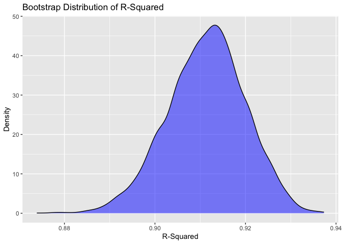
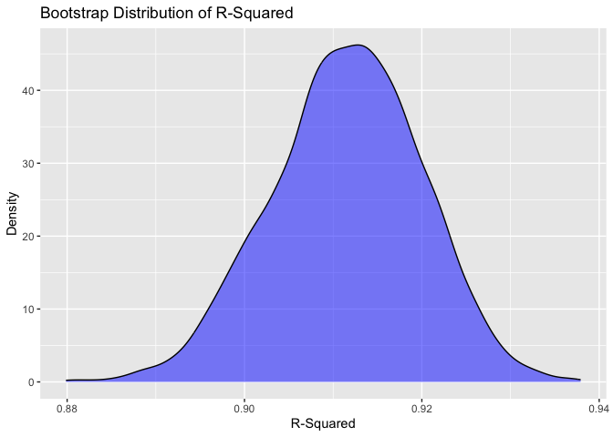
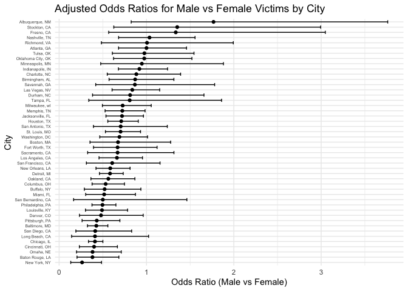
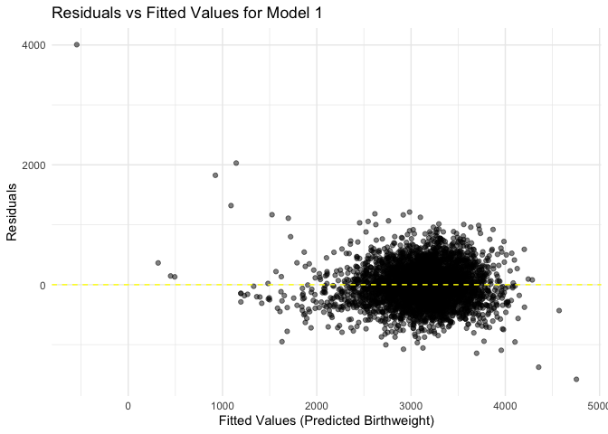
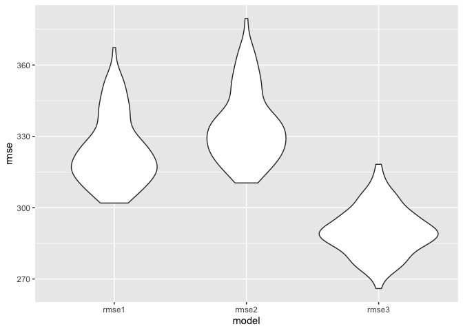

p8105_hw6_jc6422
================
Jianing Chen
2024-11-19

``` r
library(tidyverse)
```

    ## ── Attaching core tidyverse packages ──────────────────────── tidyverse 2.0.0 ──
    ## ✔ dplyr     1.1.4     ✔ readr     2.1.5
    ## ✔ forcats   1.0.0     ✔ stringr   1.5.1
    ## ✔ ggplot2   3.5.1     ✔ tibble    3.2.1
    ## ✔ lubridate 1.9.3     ✔ tidyr     1.3.1
    ## ✔ purrr     1.0.2     
    ## ── Conflicts ────────────────────────────────────────── tidyverse_conflicts() ──
    ## ✖ dplyr::filter() masks stats::filter()
    ## ✖ dplyr::lag()    masks stats::lag()
    ## ℹ Use the conflicted package (<http://conflicted.r-lib.org/>) to force all conflicts to become errors

``` r
library(modelr)
set.seed(1)
```

## Problem 1

Import dataset

``` r
weather_df = 
  rnoaa::meteo_pull_monitors(
    c("USW00094728"),
    var = c("PRCP", "TMIN", "TMAX"), 
    date_min = "2017-01-01",
    date_max = "2017-12-31") %>%
  mutate(
    name = recode(id, USW00094728 = "CentralPark_NY"),
    tmin = tmin / 10,
    tmax = tmax / 10) %>%
  select(name, id, everything())
```

    ## using cached file: /Users/jianingchen/Library/Caches/org.R-project.R/R/rnoaa/noaa_ghcnd/USW00094728.dly

    ## date created (size, mb): 2024-09-26 10:28:11.932947 (8.651)

    ## file min/max dates: 1869-01-01 / 2024-09-30

Define bootstrap resampling function

``` r
boot_straps = 
  tibble(strap_number = 1:5000,
         strap_sample = rerun(5000, sample_frac(weather_df, replace = TRUE)))
```

    ## Warning: `rerun()` was deprecated in purrr 1.0.0.
    ## ℹ Please use `map()` instead.
    ##   # Previously
    ##   rerun(5000, sample_frac(weather_df, replace = TRUE))
    ## 
    ##   # Now
    ##   map(1:5000, ~ sample_frac(weather_df, replace = TRUE))
    ## This warning is displayed once every 8 hours.
    ## Call `lifecycle::last_lifecycle_warnings()` to see where this warning was
    ## generated.

Perform linear regression on each bootstrap sample

``` r
boot_results = boot_straps %>%
  mutate(
    models = map(strap_sample, ~lm(tmax ~ tmin, data = .x)),
    results = map(models, ~{
      glance_result = broom::glance(.x)
      r_squared = glance_result$r.squared
      
      tidy_result= broom::tidy(.x)
      coef_result = log(tidy_result$estimate[1] * tidy_result$estimate[2])
      
      tibble(
        r_squared = r_squared,
        coef_result = coef_result
      )
    })
  ) %>%
  select(strap_number,results) %>%
  unnest(results)
```

Compute 2.5% and 97.5% quantiles

``` r
summary = boot_results %>%
  summarize(
    r_squared_mean = mean(r_squared),
    r_squared_sd = sd(r_squared),
    r_squared_ci_lower = quantile(r_squared, 0.025),
    r_squared_ci_upper = quantile(r_squared, 0.975),
    log_coef_mean = mean(coef_result),
    log_coef_sd = sd(coef_result),
    log_coef_ci_lower = quantile(coef_result, 0.025),
    log_coef_ci_upper = quantile(coef_result, 0.975)
  ) 
summary
```

    ## # A tibble: 1 × 8
    ##   r_squared_mean r_squared_sd r_squared_ci_lower r_squared_ci_upper
    ##            <dbl>        <dbl>              <dbl>              <dbl>
    ## 1          0.911      0.00858              0.894              0.927
    ## # ℹ 4 more variables: log_coef_mean <dbl>, log_coef_sd <dbl>,
    ## #   log_coef_ci_lower <dbl>, log_coef_ci_upper <dbl>

The CI for R^squared is (0.894, 0.927)

The CI for log(beta0\*beta1) is (1.965,2.059)

Plot the distributions

``` r
boot_results %>%
  ggplot(aes(x = r_squared)) +
  geom_density(fill = "blue", alpha = 0.5) +
  labs(title = "Bootstrap Distribution of R-Squared", x = "R-Squared", y = "Density")
```

<!-- -->

This plot shows the distribution of R^2, which is approximately normal.
The range is narrow. The peak is around 0.91.

``` r
boot_results %>%
  ggplot(aes(x = coef_result)) +
  geom_density(fill = "yellow", alpha = 0.5) +
  labs(title = "Bootstrap Distribution of log(beta0 * beta1)", x = "log(beta0 * beta1)", y = "Density")
```

<!-- -->

This plot shows the distribution of log(beta0 \* beta1), which is also
approximately normal. The peak is around 2.02.

## Problem 2

Import dataset

``` r
data1= read_csv("data/homicide-data.csv")
```

    ## Rows: 52179 Columns: 12
    ## ── Column specification ────────────────────────────────────────────────────────
    ## Delimiter: ","
    ## chr (9): uid, victim_last, victim_first, victim_race, victim_age, victim_sex...
    ## dbl (3): reported_date, lat, lon
    ## 
    ## ℹ Use `spec()` to retrieve the full column specification for this data.
    ## ℹ Specify the column types or set `show_col_types = FALSE` to quiet this message.

Clean data

``` r
data1 = data1 %>%
  mutate(
    city_state = paste(city, state, sep = ", "),
    victim_age = as.numeric(victim_age)
  ) %>%
  filter(
    !(is.na(victim_age)),
    !(city_state %in% c("Dallas, TX", "Phoenix, AZ", "Kansas City, MO", "Tulsa, AL")),
    victim_race %in% c("White", "Black")
  )
```

    ## Warning: There was 1 warning in `mutate()`.
    ## ℹ In argument: `victim_age = as.numeric(victim_age)`.
    ## Caused by warning:
    ## ! NAs introduced by coercion

``` r
data1
```

    ## # A tibble: 39,403 × 13
    ##    uid        reported_date victim_last  victim_first victim_race victim_age
    ##    <chr>              <dbl> <chr>        <chr>        <chr>            <dbl>
    ##  1 Alb-000003      20100601 SATTERFIELD  VIVIANA      White               15
    ##  2 Alb-000005      20100102 MULA         VIVIAN       White               72
    ##  3 Alb-000006      20100126 BOOK         GERALDINE    White               91
    ##  4 Alb-000009      20100130 MARTIN-LEYVA GUSTAVO      White               56
    ##  5 Alb-000016      20100308 GRAY         STEFANIA     White               43
    ##  6 Alb-000018      20100323 DAVID        LARRY        White               52
    ##  7 Alb-000019      20100402 BRITO        ELIZABETH    White               22
    ##  8 Alb-000021      20100423 KING         TEVION       Black               15
    ##  9 Alb-000022      20100423 BOYKIN       CEDRIC       Black               25
    ## 10 Alb-000023      20100518 BARRAGAN     MIGUEL       White               20
    ## # ℹ 39,393 more rows
    ## # ℹ 7 more variables: victim_sex <chr>, city <chr>, state <chr>, lat <dbl>,
    ## #   lon <dbl>, disposition <chr>, city_state <chr>

Fit a Logistic regression for Baltimore,MD

``` r
balti = data1 %>%
  filter(city_state == "Baltimore, MD") %>%
  mutate(resolved = ifelse(disposition == "Closed by arrest", 1, 0))

balti_model = glm(resolved ~ victim_age + victim_sex + victim_race, 
                       family = binomial, data = balti)

balti_model
```

    ## 
    ## Call:  glm(formula = resolved ~ victim_age + victim_sex + victim_race, 
    ##     family = binomial, data = balti)
    ## 
    ## Coefficients:
    ##      (Intercept)        victim_age    victim_sexMale  victim_raceWhite  
    ##         0.309981         -0.006727         -0.854463          0.841756  
    ## 
    ## Degrees of Freedom: 2752 Total (i.e. Null);  2749 Residual
    ## Null Deviance:       3568 
    ## Residual Deviance: 3493  AIC: 3501

Obtain the estimate and confidence interval of the adjusted odds ratio.

``` r
balti_or = broom::tidy(balti_model, conf.int = TRUE, exponentiate = TRUE) %>%
  filter(term == "victim_sexMale")
balti_or
```

    ## # A tibble: 1 × 7
    ##   term           estimate std.error statistic  p.value conf.low conf.high
    ##   <chr>             <dbl>     <dbl>     <dbl>    <dbl>    <dbl>     <dbl>
    ## 1 victim_sexMale    0.426     0.138     -6.18 6.26e-10    0.324     0.558

Fit a logistic regression for all cities

``` r
city = data1 %>%
  mutate(resolved = ifelse(disposition == "Closed by arrest", 1, 0))

city_model = city %>%
  group_by(city_state) %>%
  nest() %>%
  mutate(
    model = map(data, ~ glm(resolved ~ victim_age + victim_sex + victim_race, 
                            family = binomial, data = .x)),
    results = map(model, ~ broom::tidy(.x, conf.int = TRUE, exponentiate = TRUE))
  ) %>%
  unnest(results) %>%
  filter(term == "victim_sexMale") %>%
  select(city_state, estimate, conf.low, conf.high)
```

    ## Warning: There were 44 warnings in `mutate()`.
    ## The first warning was:
    ## ℹ In argument: `results = map(model, ~broom::tidy(.x, conf.int = TRUE,
    ##   exponentiate = TRUE))`.
    ## ℹ In group 1: `city_state = "Albuquerque, NM"`.
    ## Caused by warning:
    ## ! glm.fit: fitted probabilities numerically 0 or 1 occurred
    ## ℹ Run `dplyr::last_dplyr_warnings()` to see the 43 remaining warnings.

``` r
city_model
```

    ## # A tibble: 47 × 4
    ## # Groups:   city_state [47]
    ##    city_state      estimate conf.low conf.high
    ##    <chr>              <dbl>    <dbl>     <dbl>
    ##  1 Albuquerque, NM    1.77     0.825     3.76 
    ##  2 Atlanta, GA        1.00     0.680     1.46 
    ##  3 Baltimore, MD      0.426    0.324     0.558
    ##  4 Baton Rouge, LA    0.381    0.204     0.684
    ##  5 Birmingham, AL     0.870    0.571     1.31 
    ##  6 Boston, MA         0.674    0.353     1.28 
    ##  7 Buffalo, NY        0.521    0.288     0.936
    ##  8 Charlotte, NC      0.884    0.551     1.39 
    ##  9 Chicago, IL        0.410    0.336     0.501
    ## 10 Cincinnati, OH     0.400    0.231     0.667
    ## # ℹ 37 more rows

Create a plot shows the estimated ORs and CIs for each city.

``` r
city_model %>%
  ggplot(aes(x = estimate, y = reorder(city_state, estimate))) +
  geom_point() +
  geom_errorbar(aes(xmin = conf.low, xmax = conf.high), width = 0.6) +
  labs(
    title = "Adjusted Odds Ratios for Male vs Female Victims by City",
    x = "Odds Ratio (Male vs Female)",
    y = "City"
  ) +
  theme_minimal() +
  theme(
    axis.text.y = element_text(size = 5)
  )
```

<!-- -->

Based on this plot, Albuquerque, NM has the largest confidence interval,
which suggests a high level of uncertainty, and New York, NY has the
smallest confidence interval.

The majority of cities have adjusted odds ratios close to 1, indicates
that there is no significant difference in the likelihood of solving
homicides between male and female victims and gender does not play a
strong role in determining whether a homicide is resolved.

A few cities show ORs below 1, suggests that homicides involving female
victims are resolved at a slightly higher rate. For some cities show ORs
higher than 1 indicates a higher likelihood of solving homicides for
male victims compared to female victims, but the higher confidence
interval reduces the reliability of the observed effect.

## Question 3

Import data

``` r
data2= read_csv("data/birthweight.csv")
```

    ## Rows: 4342 Columns: 20
    ## ── Column specification ────────────────────────────────────────────────────────
    ## Delimiter: ","
    ## dbl (20): babysex, bhead, blength, bwt, delwt, fincome, frace, gaweeks, malf...
    ## 
    ## ℹ Use `spec()` to retrieve the full column specification for this data.
    ## ℹ Specify the column types or set `show_col_types = FALSE` to quiet this message.

Clean the data

``` r
data2 = data2 %>%
  mutate(
    babysex = factor(babysex, levels = c(1,2), labels = c("Male", "Female")),
    malform = factor(malform, levels = c(0,1), labels = c("Absent", "Present")),
    mrace = factor(mrace),
    frace = factor(frace),
  ) %>%
  drop_na()
```

Model 1: Hypothesis model

Predictors: `blength`, `gaweeks`, `delwt`, `fincome`, `smoken`,`wtgain`.

``` r
model1 = lm(bwt ~ blength + gaweeks + delwt + fincome + smoken + wtgain, data = data2)

model1
```

    ## 
    ## Call:
    ## lm(formula = bwt ~ blength + gaweeks + delwt + fincome + smoken + 
    ##     wtgain, data = data2)
    ## 
    ## Coefficients:
    ## (Intercept)      blength      gaweeks        delwt      fincome       smoken  
    ##   -4331.590      121.249       24.632        2.149        1.764       -3.600  
    ##      wtgain  
    ##       3.030

Model 2(simple model): using length at birth and gestational age as
predictors

``` r
model2 = lm(bwt ~ blength + gaweeks, data = data2)
model2
```

    ## 
    ## Call:
    ## lm(formula = bwt ~ blength + gaweeks, data = data2)
    ## 
    ## Coefficients:
    ## (Intercept)      blength      gaweeks  
    ##    -4347.67       128.56        27.05

Model3(Interaction model): using head circumferenc, length, sex, and all
interactions between these

``` r
model3 = lm(bwt ~ bhead * blength * babysex, data = data2)
model3
```

    ## 
    ## Call:
    ## lm(formula = bwt ~ bhead * blength * babysex, data = data2)
    ## 
    ## Coefficients:
    ##                 (Intercept)                        bhead  
    ##                  -7176.8170                     181.7956  
    ##                     blength                babysexFemale  
    ##                    102.1269                    6374.8684  
    ##               bhead:blength          bhead:babysexFemale  
    ##                     -0.5536                    -198.3932  
    ##       blength:babysexFemale  bhead:blength:babysexFemale  
    ##                   -123.7729                       3.8781

Plot the residuals against fitted values

``` r
data2 %>%
  add_predictions(model1) %>%
  add_residuals(model1) %>%
  ggplot(aes(x = pred, y = resid)) +
  geom_point(alpha = 0.5) +
  geom_hline(yintercept = 0, linetype = "dashed", color = "yellow") +
  labs(
    title = "Residuals vs Fitted Values for Model 1",
    x = "Fitted Values (Predicted Birthweight)",
    y = "Residuals"
  ) +
  theme_minimal()
```

<!-- -->

Cross-validation for model comparison

Perform 100 Monte Carlo splits.

``` r
cv_df = 
  crossv_mc(data2, 100) %>%
  mutate(
    train = map(train, as_tibble),
    test = map(test, as_tibble)
  )
```

Fit the models to the splits.

``` r
cv_results = cv_df %>%
  mutate(
    model1 = map(.x= train, ~lm (bwt ~ blength + gaweeks + delwt + fincome + smoken + wtgain, data = .x)),
    model2 = map(.x = train , ~lm(bwt ~ blength + gaweeks, data = .x)),
    model3 = map(.x = train, ~lm(bwt ~ bhead * blength * babysex, data = .x))) %>%
  mutate(
    rmse1 = map2_dbl(.x= model1, .y = test, ~ rmse(model = .x, data = .y)),
    rmse2 = map2_dbl(.x= model2, .y = test, ~ rmse(model = .x, data = .y)),
    rmse3 = map2_dbl(.x= model3, .y = test, ~ rmse(model = .x, data = .y)))
```

Violin plot of RMSEs

``` r
cv_results %>%
  select(starts_with("rmse")) %>%
  pivot_longer(
    everything(),
    names_to = "model",
    values_to = "rmse",
    names_prefix = "rmse_"
  ) %>%
  ggplot(aes(x=model, y=rmse)) +
  geom_violin()
```

<!-- -->

Based on this violin plot, we can observe that rmse 3 has the lowest
median RMSE which suggests it performs better than other models in terms
of predictive accuracy. rmse2 have the highest RMSE which indicates less
stability in predictions to variations in corss-validation splits.
