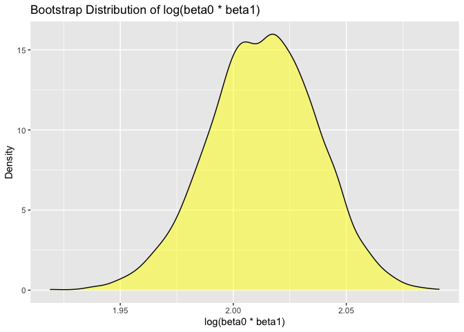

p8105_hw6_jc6422
================
Jianing Chen
2024-11-19

## Problem 1

Import dataset

``` r
weather_df = 
  rnoaa::meteo_pull_monitors(
    c("USW00094728"),
    var = c("PRCP", "TMIN", "TMAX"), 
    date_min = "2017-01-01",
    date_max = "2017-12-31") %>%
  mutate(
    name = recode(id, USW00094728 = "CentralPark_NY"),
    tmin = tmin / 10,
    tmax = tmax / 10) %>%
  select(name, id, everything())
```

    ## using cached file: /Users/jianingchen/Library/Caches/org.R-project.R/R/rnoaa/noaa_ghcnd/USW00094728.dly

    ## date created (size, mb): 2024-09-26 10:28:11.932947 (8.651)

    ## file min/max dates: 1869-01-01 / 2024-09-30

Define bootstrap resampling function

``` r
set.seed(123)
boot_samples = map(1:5000, ~sample_n(weather_df, size = nrow(weather_df), replace = TRUE))
```

Perform linear regression on each bootstrap sample

``` r
boot_results = map_dfr(
  boot_samples,
  ~ {
    model = lm(tmax ~ tmin, data = .x)
    glance_result = broom::glance(model) %>% 
      select(r.squared)
    coef_result = broom::tidy(model) %>%
      filter(term != "(Intercept)") %>%
      summarize(log_coef = log(estimate[1] * coef(model)[1]))
    cbind(glance_result, coef_result)
  }
)
```

Compute 2.5% and 97.5% quantiles

``` r
quantiles = quantile(boot_results$r.squared, probs = c(0.025, 0.975))
quantiles
```

    ##      2.5%     97.5% 
    ## 0.8945701 0.9271042

``` r
logcoef_quantiles = quantile(boot_results$log_coef, probs = c(0.025, 0.975))
logcoef_quantiles
```

    ##     2.5%    97.5% 
    ## 1.964166 2.058364

Plot the distributions

``` r
boot_results %>%
  ggplot(aes(x = r.squared)) +
  geom_density(fill = "blue", alpha = 0.5) +
  labs(title = "Bootstrap Distribution of R-Squared", x = "R-Squared", y = "Density")
```

<!-- -->

``` r
boot_results %>%
  ggplot(aes(x = log_coef)) +
  geom_density(fill = "yellow", alpha = 0.5) +
  labs(title = "Bootstrap Distribution of log(beta0 * beta1)", x = "log(beta0 * beta1)", y = "Density")
```

<!-- -->
