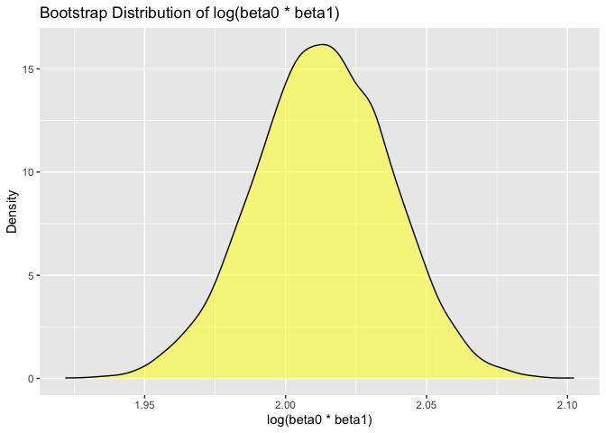

p8105_hw6_jc6422
================
Jianing Chen
2024-11-19

## Problem 1

Import dataset

``` r
weather_df = 
  rnoaa::meteo_pull_monitors(
    c("USW00094728"),
    var = c("PRCP", "TMIN", "TMAX"), 
    date_min = "2017-01-01",
    date_max = "2017-12-31") %>%
  mutate(
    name = recode(id, USW00094728 = "CentralPark_NY"),
    tmin = tmin / 10,
    tmax = tmax / 10) %>%
  select(name, id, everything())
```

    ## using cached file: /Users/jianingchen/Library/Caches/org.R-project.R/R/rnoaa/noaa_ghcnd/USW00094728.dly

    ## date created (size, mb): 2024-09-26 10:28:11.932947 (8.651)

    ## file min/max dates: 1869-01-01 / 2024-09-30

Define bootstrap resampling function

``` r
set.seed(123)
boot_samples = map(1:5000, ~sample_n(weather_df, size = nrow(weather_df), replace = TRUE))
```

Perform linear regression on each bootstrap sample

``` r
boot_results = map_dfr(
  boot_samples,
  ~ {
    model = lm(tmax ~ tmin, data = .x)
    glance_result = broom::glance(model) %>% 
      select(r.squared)
    coef_result = broom::tidy(model) %>%
      filter(term != "(Intercept)") %>%
      summarize(log_coef = log(estimate[1] * coef(model)[1]))
    cbind(glance_result, coef_result)
  }
)
```

Compute 2.5% and 97.5% quantiles

``` r
quantiles = quantile(boot_results$r.squared, probs = c(0.025, 0.975))
quantiles
```

    ##      2.5%     97.5% 
    ## 0.8945701 0.9271042

``` r
logcoef_quantiles = quantile(boot_results$log_coef, probs = c(0.025, 0.975))
logcoef_quantiles
```

    ##     2.5%    97.5% 
    ## 1.964166 2.058364

Plot the distributions

``` r
boot_results %>%
  ggplot(aes(x = r.squared)) +
  geom_density(fill = "blue", alpha = 0.5) +
  labs(title = "Bootstrap Distribution of R-Squared", x = "R-Squared", y = "Density")
```

<!-- -->

This plot shows the distribution of R^2, which is approximately normal.
The range is narrow.

``` r
boot_results %>%
  ggplot(aes(x = log_coef)) +
  geom_density(fill = "yellow", alpha = 0.5) +
  labs(title = "Bootstrap Distribution of log(beta0 * beta1)", x = "log(beta0 * beta1)", y = "Density")
```

<!-- -->

This plot shows the distribution of log(beta0 \* beta1), which is also
approximately normal.

## Problem 2

Import dataset

``` r
data1= read_csv("homicide-data.csv")
```

    ## Rows: 52179 Columns: 12
    ## ── Column specification ────────────────────────────────────────────────────────
    ## Delimiter: ","
    ## chr (9): uid, victim_last, victim_first, victim_race, victim_age, victim_sex...
    ## dbl (3): reported_date, lat, lon
    ## 
    ## ℹ Use `spec()` to retrieve the full column specification for this data.
    ## ℹ Specify the column types or set `show_col_types = FALSE` to quiet this message.

Clean data

``` r
data1 = data1 %>%
  mutate(
    city_state = paste(city, state, sep = ", "),
    victim_age = as.numeric(victim_age)
  ) %>%
  filter(
    !(is.na(victim_age)),
    !(city_state %in% c("Dallas, TX", "Phoenix, AZ", "Kansas City, MO", "Tulsa, AL")),
    victim_race %in% c("White", "Black")
  )
```

    ## Warning: There was 1 warning in `mutate()`.
    ## ℹ In argument: `victim_age = as.numeric(victim_age)`.
    ## Caused by warning:
    ## ! NAs introduced by coercion

``` r
data1
```

    ## # A tibble: 39,403 × 13
    ##    uid        reported_date victim_last  victim_first victim_race victim_age
    ##    <chr>              <dbl> <chr>        <chr>        <chr>            <dbl>
    ##  1 Alb-000003      20100601 SATTERFIELD  VIVIANA      White               15
    ##  2 Alb-000005      20100102 MULA         VIVIAN       White               72
    ##  3 Alb-000006      20100126 BOOK         GERALDINE    White               91
    ##  4 Alb-000009      20100130 MARTIN-LEYVA GUSTAVO      White               56
    ##  5 Alb-000016      20100308 GRAY         STEFANIA     White               43
    ##  6 Alb-000018      20100323 DAVID        LARRY        White               52
    ##  7 Alb-000019      20100402 BRITO        ELIZABETH    White               22
    ##  8 Alb-000021      20100423 KING         TEVION       Black               15
    ##  9 Alb-000022      20100423 BOYKIN       CEDRIC       Black               25
    ## 10 Alb-000023      20100518 BARRAGAN     MIGUEL       White               20
    ## # ℹ 39,393 more rows
    ## # ℹ 7 more variables: victim_sex <chr>, city <chr>, state <chr>, lat <dbl>,
    ## #   lon <dbl>, disposition <chr>, city_state <chr>

Fit a Logistic regression for Baltimore,MD

``` r
balti = data1 %>%
  filter(city_state == "Baltimore, MD") %>%
  mutate(resolved = ifelse(disposition == "Closed by arrest", 1, 0))

balti_model = glm(resolved ~ victim_age + victim_sex + victim_race, 
                       family = binomial, data = balti)

balti_model
```

    ## 
    ## Call:  glm(formula = resolved ~ victim_age + victim_sex + victim_race, 
    ##     family = binomial, data = balti)
    ## 
    ## Coefficients:
    ##      (Intercept)        victim_age    victim_sexMale  victim_raceWhite  
    ##         0.309981         -0.006727         -0.854463          0.841756  
    ## 
    ## Degrees of Freedom: 2752 Total (i.e. Null);  2749 Residual
    ## Null Deviance:       3568 
    ## Residual Deviance: 3493  AIC: 3501

Obtain the estimate and confidence interval of the adjusted odds ratio.

``` r
balti_or = broom::tidy(balti_model, conf.int = TRUE, exponentiate = TRUE) %>%
  filter(term == "victim_sexMale")
balti_or
```

    ## # A tibble: 1 × 7
    ##   term           estimate std.error statistic  p.value conf.low conf.high
    ##   <chr>             <dbl>     <dbl>     <dbl>    <dbl>    <dbl>     <dbl>
    ## 1 victim_sexMale    0.426     0.138     -6.18 6.26e-10    0.324     0.558
